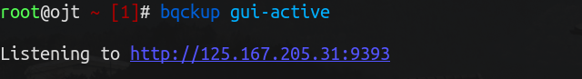
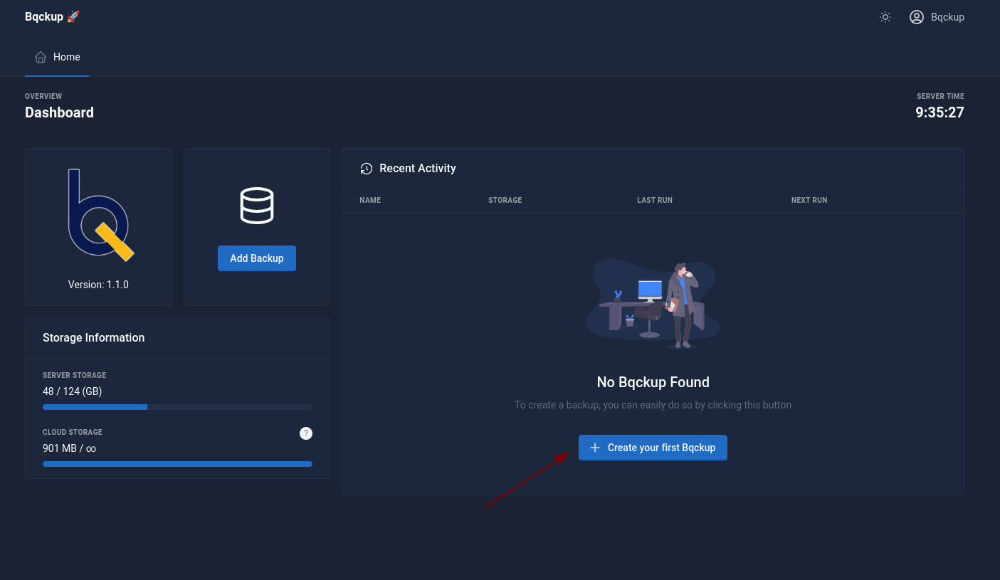
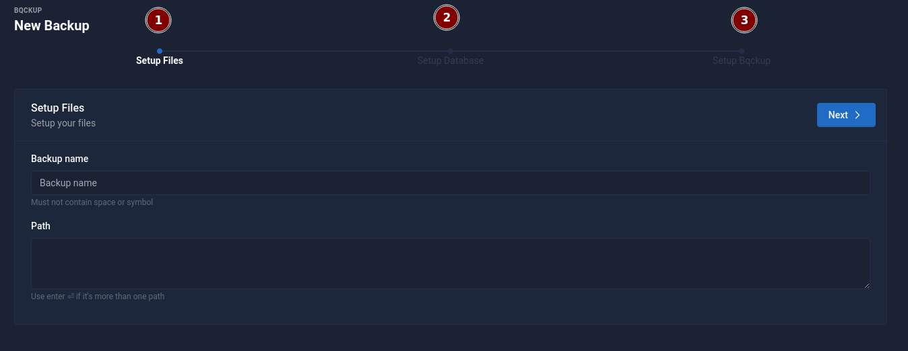
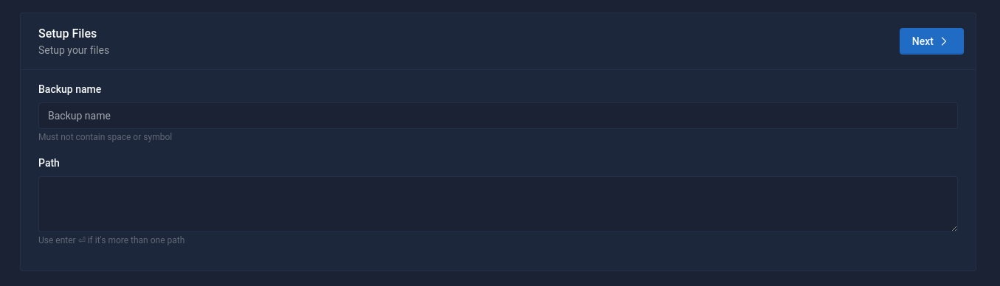
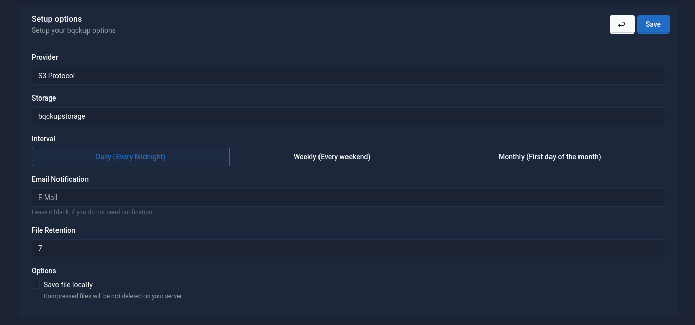

# Add Backup

There are two methods for adding backups. The first method involves using YML files, while the second method is through the use of a Graphical User Interface (GUI).

Personally, I prefer the first option of using YML files for adding backups. As a programmer, I find this method more comfortable and efficient to work with.

## YML

Below is an example of the YML configuration for the backups,it should be saved in `/etc/backup/sites/config_name.yml`


```yaml
bqckup:
  name: mywebsite
  path:
    - /var/www/html
  options:
    storage: bqckupstorage
    interval: daily
    retention: '7'
    save_locally: no
    provider: s3
    destination: ''
  database:
    host: localhost
    type: mysql
    name: mydatabase
    user: myuser
    password: mypassword
```


## Web View ( GUI )

To add backups through the Graphical User Interface (GUI), the first step is to activate the webview by using the command:

```shell
bqckup gui-active
```

Once the command is executed, a notification will appear indicating that the webview is now accessible and ready to use and you can access it by visiting `http://{your_public_ip}:{port}` port default is 9393

<figure><figcaption></figcaption></figure>

After activating the webview, you will see a sign-in page. Use the key to access the backup. The key can be found in the backup configuration file located at `/etc/backup/backup.cnf`

```
[auth]
; Authentication password for the web interface
password=bqckup
```

<figure><figcaption><p>Bqckup Dashboard</p></figcaption></figure>

After successfully signing in, you will be directed to the dashboard. There, you can click on the "**Add Backup**" button or "**Create Your First Backup**" button to start adding backups.

<figure><figcaption><p>Form add bqckup</p></figcaption></figure>

like the YML configuration, the form for adding backups is also divided into three sections

### 1. Files  & Folder

<figure><figcaption><p>Files &#x26; Folder Section</p></figcaption></figure>

The first section, Folder and files, is where you specify the location(s) of the folder(s) and file(s) that you wish to backup. It's possible to select multiple folders and files for backup.

### 2. Database

<figure><figcaption><p>Database Section</p></figcaption></figure>

The Database section is optional and you may choose to skip it if you don't have any databases that need to be backed up


Please note that at this time, the Database section only supports MySQL and PostgreSQL


### 3. Options

<figure><figcaption><p>Opitons section</p></figcaption></figure>

The above is the display of the option field section.


1. Currently, it only supports Local Storage and S3 Storage.
2. The list that appears in the storage column is the list of storage that is in `/etc/bqckup/config/storages.yml.`



