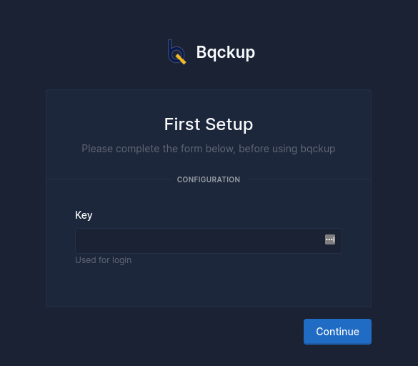
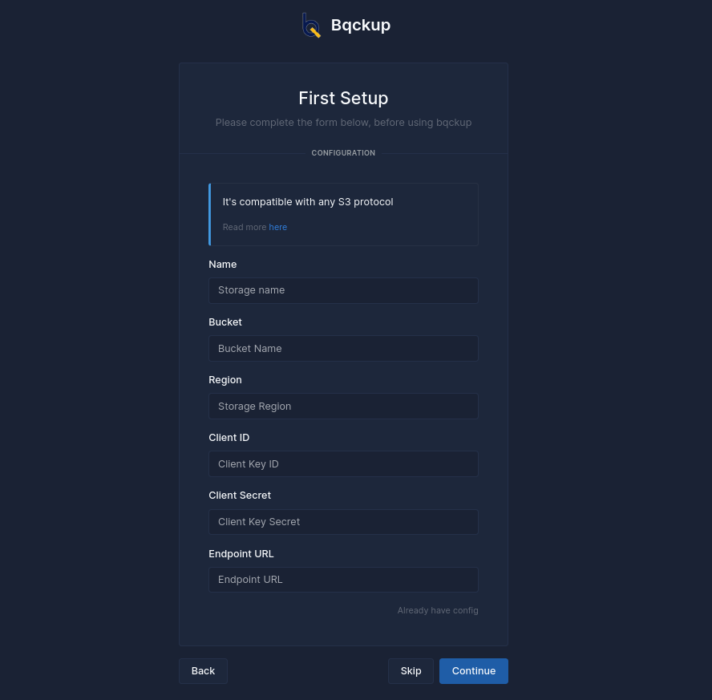

# First Setup

After successfully installing the bqckup software, the first setup requires you to enable the webview feature by running the following command:

```bash
bqckup gui-active
```

If you receive a message similar to the image below, it means that you have successfully activated the webview. The next step is to access the webview by visiting http://public\_ip:port (default 9393).

You will then be presented with this form:

<figure><figcaption><p>First Form ( Setup Key / Password)</p></figcaption></figure>

The first form is where you set the key/password that will be used to log in and access the bqckup dashboard

<figure><figcaption><p>Second Form ( Storage configuration )</p></figcaption></figure>

The second form is for the initial setup of storage. If you do not have any storage yet, you can skip this step by clicking the **Button Skip**. If you already have storage, you can complete the details of the storage you want and it will be used as the config for storages.yml. If you already have a **storages.yml config**, you can upload it directly without filling in the form by clicking **already have config**
