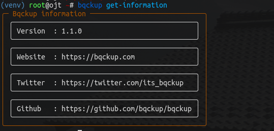

# Installation

## Install Requirements

Before using Backup, it is necessary to install the required packages. Backup only requires `sqlite3` to function. Here are the installation instructions for Linux Debian and CentOS systems:



```bash
sudo apt-get install sqlite3
```



```bash
sudo yum install sqlite3
```



## Installation

Debian / CentOS is using the same script.

```bash
curl https://raw.githubusercontent.com/bqckup/bqckup/1x/install.sh | bash
```

then you can check it by running this command:

```bash
bqckup get-information
```

the output should be similar to the following picture

<figure><figcaption></figcaption></figure>
